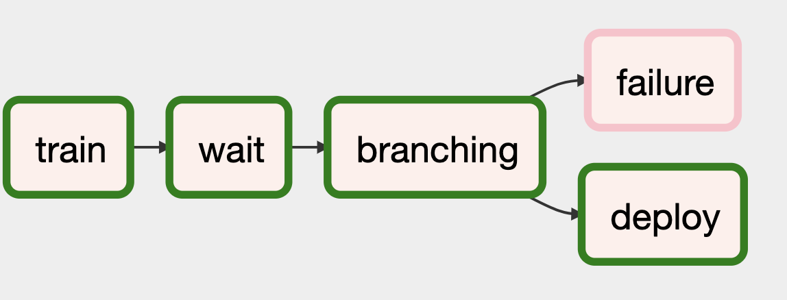

# Using Determined + Airflow for End to End Workflows

This repository contains an example [Airflow DAG](https://airflow.apache.org/) that trains a model [using Determined](https://github.com/determined-ai/determined) and then deploys that model [using Seldon Core](https://github.com/SeldonIO/seldon-core).

## Prerequisites
Your airflow executor will need to have the Python packages in (the requirements file)[requirements.txt] in order to run this workflow.  Alternatively, you can bundle this DAG with a virtual environment that has those dependencies installed.

Additionally, your airflow executor will need access to a Kuberenetes cluster config that allows it to create `Seldon Deployments`.

## Usage
The [DAG in this example](train_and_deploy_dag.py) trains an MNIST model using Determined, then deploys it into kubernetes using Seldon Core.  The model you train and deploy is all configurable via workflow parameters (with defaults set in the file).
