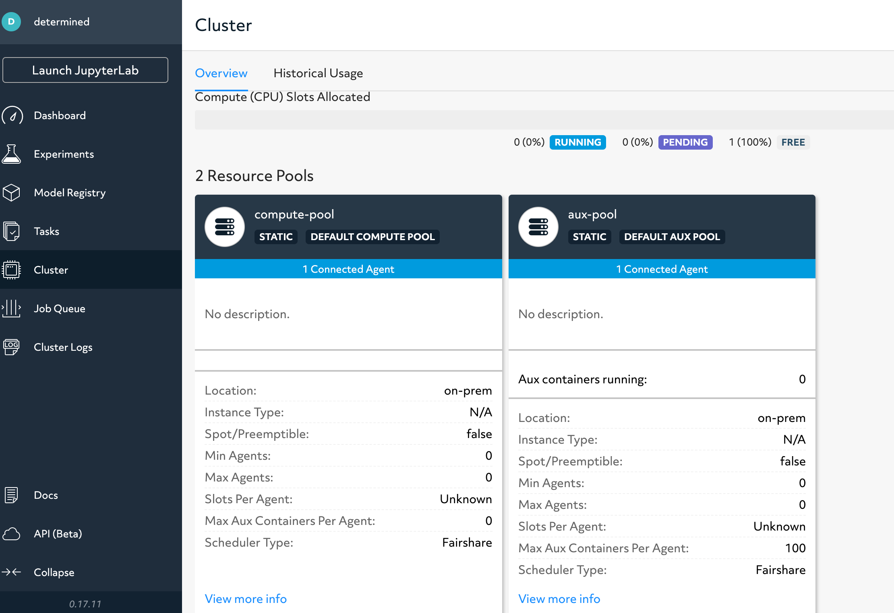
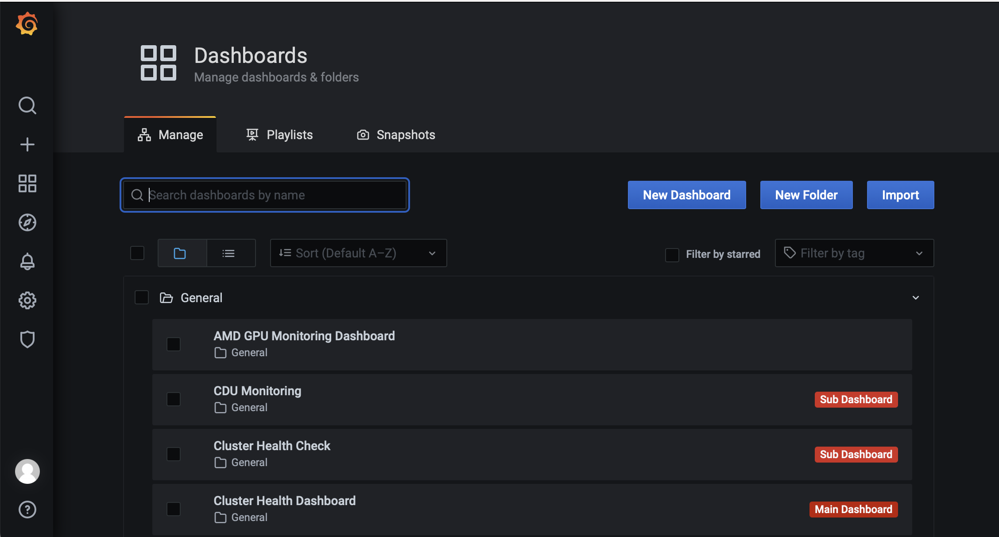
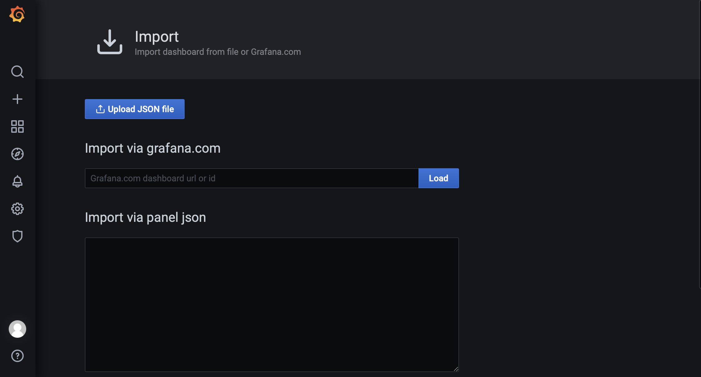
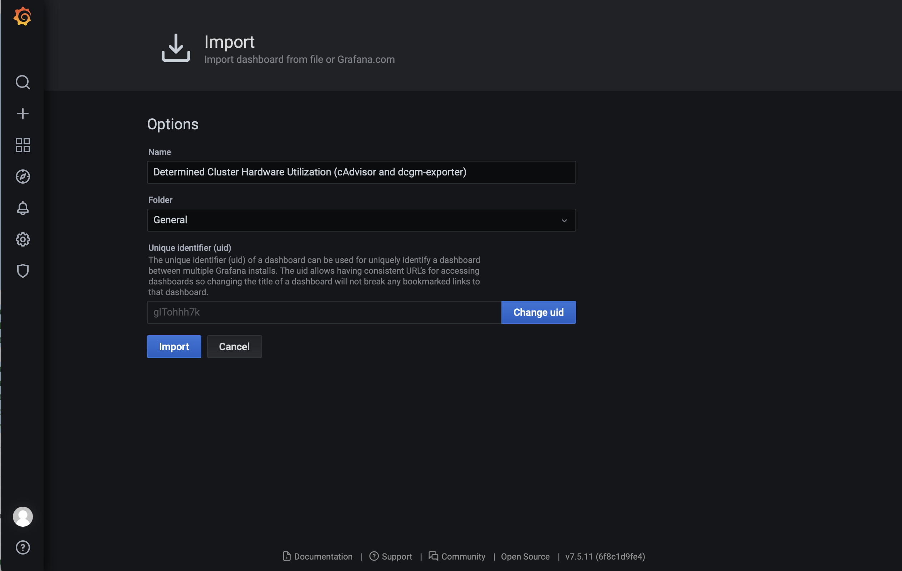

# HPE ML Dev Sys Installation Guide

This guide provides steps for the installation teams to install the HPE ML Development Environment ("Environment") on the HPE ML Development System ("System") with HPCM. 

This installation guide has tested on the following versions:

| Supported Versions |
|--------------------|
| RHEL 8.5           |
| HPCM 1.7           |
| ML Dev Env 0.17.15 |

This guide assumes:

1. the installation team is familiar with general debugging skills on RHEL.
2. the installation team is familiar with HPCM.
3. the installation team knows what an HPE ML Dev Sys is. 
4. the following files are downloaded:
   - `hpemlds-login-0.17.15-rhel-8.5.tar.gz` for the System login service node
   - `hpemlds-master-0.17.15-rhel-8.5.tar.gz` for the System master service node
   - `hpemlds-agent-cuda-0.17.15-rhel-8.5.tar.gz` for the System agent compute node with Nvidia GPUs and Infiniband

HPE ML Dev System contains four types of nodes:

- one HPCM admin node (HPCM management node on a DL325, the first node to be installed)
- one master service node (HPCM compute node on a DL325)
- one login service node (HPCM compute node on a DL325)
- multiple agent compute nodes (HPCM compute node on an Apollo 6500 with Nvidia A100 GPUs)

With this guide, you should be able to install the four types of nodes with the given order.

## Step 1 - Prerequisites

1. HPCM admin node is the first node that needs to be installed before other nodes. We assume you can provision the admin node and install HPCM on it yourself.
2. Set the hostname of the admin node, the master node, and the login node to be `admin`, `master`, and `login` by running `cm node set --name admin -n <node-name>`. The racking positions of the nodes do not matter when you choose the nodes to rename.
3. The master IP address has to be static. If the master IP address is changed, you need to re-run the procedure again.

## Step 2 - Provisioning the Login, Master, and Agent Nodes

Assuming you are on the admin node, use the following commands to provision the nodes.

```bash
# Copy the tar ball files to the HPCM admin node

# Extract the tar file and add the image to HPCM
tar -C /opt/clmgr/image/images --xattrs --acls --xattrs-include=* -zpxvf hpe-mlde-master-0.17.15-rhel-8.5.tar.gz
cm image create -i hpe-mlde-master-0.17.15-rhel-8.5 --use-existing
tar -C /opt/clmgr/image/images --xattrs --acls --xattrs-include=* -zpxvf hpe-mlde-login-0.17.15-rhel-8.5.tar.gz
cm image create -i hpe-mlde-login-0.17.15-rhel-8.5 --use-existing
tar -C /opt/clmgr/image/images --xattrs --acls --xattrs-include=* -zpxvf hpe-mlde-agent-cuda-0.17.15-rhel-8.5.tar.gz
cm image create -i hpe-mlde-agent-cuda-0.17.15-rhel-8.5 --use-existing

# Provision the nodes from the scratch space.
# Note that the following command will only create partitions on one disk for booting.
# NOTE: If customers order more than one disk on the node, you need to follow the HPCM guide to create partitions. Please stick to the customers' requests.
# NOTE: Booting a node with an overridden image requires the boot order to be PXE over IPv4 first. You might need to use `efibootmgr` to change it.
cm node provision -i hpe-mlde-master-0.17.15-rhel-8.5 -n master --force-disk /dev/sda --wipe-disk
cm node provision -i hpe-mlde-login-0.17.15-rhel-8.5 -n login --force-disk /dev/sda --wipe-disk
cm node provision -i hpe-mlde-agent-cuda-0.17.15-rhel-8.5 -n <node-names> --force-disk /dev/nvme0n1 --wipe-disk
```

## Step 3 - Check if the Services on the Master Node is running

Assuming you are on the master node, run the following command to start the services and check if the services are running:

```bash
/root/hpe-mlde-master-start.sh
```

and

```bash
# docker ps
CONTAINER ID   IMAGE                                  COMMAND                  CREATED          STATUS          PORTS     NAMES
797ba6a1eb3e   determinedai/hpe-mlde-master:0.17.15   "/usr/bin/determined…"   4 seconds ago    Up 3 seconds              hpe-mlde-master
c68d35ef0810   postgres:10                            "docker-entrypoint.s…"   12 seconds ago   Up 11 seconds             hpe-mlde-db
```

You should see similar results as above. The status should show `UP` for all the containers. If it shows other results such as `Restarted`, run the following commands to save the logs:

```bash
docker logs hpe-mlde-master &> hpe-mlde-master.log
docker logs hpe-mlde-db &> hpe-mlde-db.log
```

, and send the log files to us.

## Step 4 - Check if the Services on the Login Node is running

Assuming you are on the login node, run the following command to start the services and check if the services are running:

```bash
/root/hpe-mlde-login-start.sh
```

and

```bash
# docker ps
CONTAINER ID   IMAGE                                 COMMAND                  CREATED          STATUS                             PORTS                                       NAMES
d97dd9d6fa30   fluent/fluent-bit:1.6                 "/fluent-bit/bin/flu…"   1 second ago     Up 1 second                                                                    determined-fluent
dbd69a1c5ce6   determinedai/hpe-mlde-agent:0.17.15   "/run/determined/wor…"   2 seconds ago    Up 1 second                                                                    hpe-mlde-agent
cd2cbd8dea4f   gcr.io/cadvisor/cadvisor:v0.36.0      "/usr/bin/cadvisor -…"   27 seconds ago   Up 26 seconds (health: starting)   0.0.0.0:8080->8080/tcp, :::8080->8080/tcp   cadvisor
```

You should see similar results as above. The status should show `UP` for all the containers. If it shows other results such as `Restarted`, run the following commands to save the logs:

```bash
docker logs determined-fluent &> determined-fluent.log
docker logs hpe-mlde-agent &> hpe-mlde-agent.log
docker logs cadvisor &> cadvisor.log
```

, and send the log files to us.

## Step 5 - Check if the Services on the Agent Compute Node (Apollo 6500 with Nvidia GPUs) is running

Assuming you are on the agent node, run the following command to start the services and check if the services are running:

```bash
/root/hpe-mlde-agent-cuda-start.sh
```

and

```bash
# docker ps
CONTAINER ID   IMAGE                                                      COMMAND                  CREATED          STATUS                             PORTS                                       NAMES
c250d9de3c5c   fluent/fluent-bit:1.6                                      "/fluent-bit/bin/flu…"   3 seconds ago    Up 2 seconds                                                                   determined-fluent
8a7eb011ea25   determinedai/hpe-mlde-agent:0.17.15                        "/run/determined/wor…"   4 seconds ago    Up 3 seconds                                                                   hpe-mlde-agent
97c18523930c   gcr.io/cadvisor/cadvisor:v0.36.0                           "/usr/bin/cadvisor -…"   26 seconds ago   Up 25 seconds (health: starting)   0.0.0.0:8080->8080/tcp, :::8080->8080/tcp   cadvisor
34eaa05d12fc   nvcr.io/nvidia/k8s/dcgm-exporter:2.3.2-2.6.3-ubuntu20.04   "/usr/local/dcgm/dcg…"   32 seconds ago   Up 31 seconds                      0.0.0.0:9400->9400/tcp, :::9400->9400/tcp   dgcm-exporter
```

You should see similar results as above. The status should show `UP` for all the containers. If it shows other results such as `Restarted`, run the following commands to save the logs:

```bash
docker logs determined-fluent &> determined-fluent.log
docker logs hpe-mlde-agent &> hpe-mlde-agent.log
docker logs cadvisor &> cadvisor.log
docker logs dgcm-exporter &> dgcm-exporter.log
```

, and send the log files to us.

## Step 6 - Check the overall installation

(Option 1) Go to the master web at `<master address:8080>`. You should be able to log in with the default username `determined` and an empty password. After click the cluster tab on the left navigation bar, you should be able to see two resource pools `compute-pool` and `aux-pool`:

- The compute pool should contain multiple connected agents depending on how many compute nodes are installed.
- The aux pool should contain only one connected agent.

See the image below:



(Option 2) Run the following command to check the installation:

```bash
curl <master-address>:8080/agents
```

Note that you need to check the `resource_pool` and `slots` fields to validate:

- The compute pool should contain multiple connected agents depending on how many compute nodes are installed.
- The aux pool should contain only one connected agent.

An example json looks like:

```json
{
  "/agents/5a5ec5a22303": {
    ...
    "slots": {
      "/agents/5a5ec5a22303/slots/0": {
        "id": "0",
        "device": {
          "id": 0,
          "brand": "Intel(R) Xeon(R) Gold 6126 CPU @ 2.60GHz x 48 cores",
          "uuid": "GenuineIntel",
          "type": "cpu"
        },
        "enabled": true,
        "container": null,
        "draining": false
      }
    },
    "resource_pool": "aux-pool",
    ...
  },
  "/agents/8a7eb011ea25": {
    ...
    "slots": {
      "/agents/8a7eb011ea25/slots/0": {
        "id": "0",
        "device": {
          "id": 0,
          "brand": "Tesla V100-SXM2-16GB",
          "uuid": "GPU-6800089c-a4ba-3e01-3d1f-f556326cedab",
          "type": "cuda"
        },
        "enabled": true,
        "container": null,
        "draining": false
      },
      ...
    },
    "resource_pool": "compute-pool",
    ...
  }
}
```

## Step 7 - Configuring and Running Monitoring Services on Admin Node

Note that because of the System's limited support for HPCM, some steps need to be done manually.

Find the following configuration files in the guide:

- `hpe-mlds-dashboard.json` for the Grafana dashboard json.

Assuming you are on the admin node, replace the original Prometheus configuration file `/etc/prometheus/prometheus.yml` with the file [hpe-mlds-prometheus-jobs.yaml](hpe-mlds-prometheus-jobs.yaml). You can run the following command to do that.

```bash
cat << EOF > /etc/prometheus/prometheus.yml
# my global config
global:
  scrape_interval: 15s # Set the scrape interval to every 15 seconds. Default is every 1 minute.
  evaluation_interval: 15s # Evaluate rules every 15 seconds. The default is every 1 minute.
  # scrape_timeout is set to the global default (10s).

# Alertmanager configuration
alerting:
  alertmanagers:
    - static_configs:
        - targets:
          # - alertmanager:9093

# Load rules once and periodically evaluate them according to the global 'evaluation_interval'.
rule_files:
# - "first_rules.yml"
# - "second_rules.yml"

# A scrape configuration containing exactly one endpoint to scrape:
# Here it's Prometheus itself.
scrape_configs:
  - job_name: "prometheus"

    # metrics_path defaults to '/metrics'
    # scheme defaults to 'http'.

    static_configs:
      - targets: ["localhost:9090"]

  - job_name: det-master
    honor_timestamps: true
    scrape_interval: 1s
    scrape_timeout: 1s
    metrics_path: prom/det-state-metrics
    scheme: http
    follow_redirects: true
    metric_relabel_configs:
      - source_labels: [task_actor]
        separator: ;
        regex: /experiments/(.+)\/.*\/.*
        target_label: experiment_id
        replacement: $1
        action: replace
    static_configs:
      - targets:
          - $(/opt/clmgr/bin/cm node show -n master -M --display-no-header | awk '{print $3}'):8080
  - job_name: cadvisor-dcgm
    honor_timestamps: true
    scrape_interval: 1s
    scrape_timeout: 1s
    metrics_path: /metrics
    scheme: http
    follow_redirects: true
    metric_relabel_configs:
      - source_labels: [id]
        separator: ;
        regex: /docker/(.*)
        target_label: container_runtime_id
        replacement: $1
        action: replace
      - source_labels: [__name__, UUID]
        separator: ;
        regex: DCGM.*;(.*)
        target_label: gpu_uuid
        replacement: $1
        action: replace
    http_sd_configs:
      - follow_redirects: true
        refresh_interval: 1m
        url: http://$(/opt/clmgr/bin/cm node show -n master -M --display-no-header | awk '{print $3}'):8080/prom/det-http-sd-config
EOF

# After editing the configuration, start the monitoring services.
cm sim disable
cm sim enable
cm sim start
```

Run the following command to check if the monitoring services are running.

```bash
$ cm sim status
Running is-active for prometheus service : prometheus.service 

admin: active

...
```

Go to the web interface of the HPE ML Sys Grafana at `<admin-address>/grafana/dashboards`. Use the default username and password `admin` and `admin`. You should see the following view:



Click on the blue "Import" button on the top right corner under the "Manage" tab. You should see:



Copy and paste the [hpe-mlds-dashboard.json](hpe-mlds-dashboard.json) into the "Import via panel json" inbox and click on "Load". You will see the following dialog:




Click on "Import" to confirm.

The imported dashboard should look like the below image:


If you have gone to this step, you are all set!


## Troubleshooting

1. As part of installing the agents, when running `hpe-mlde-agent-cuda-start.sh`, the logs shows:

```
Error: No such container: dgcm-exporter
Error: No such container: cadvisor
Error: No such container: hpe-mlde-agent
```

Is it an issue?

- No, it is to delete duplicate containers if the container names are being used by a previous run. You can ignore the message.

2. When installing the agents, I have seen the errors in the logs of the container `hpe-mlde-agent`. Should I be concerned about it?

- No. As long as the status shows "UP" and the final check for the overall installation passes, it is fine. The errors in the containers are not related to installation.

3. Some files, like `hpe-mlde-install-validation-tool-0.17.14.tar`, is not used in the installation guide. Am I doing anything wrong?

- No. This file is to help debug the issue if the R&D team needs to interfere with it.