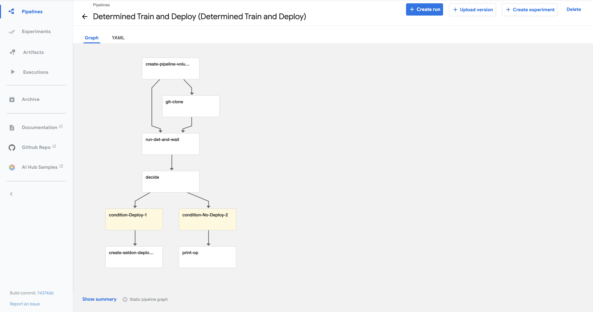

# Using Determined + Kubeflow Pipelines
<p align="center">
</p>


This repository contains an example [Kubeflow Pipeline](https://www.kubeflow.org/docs/pipelines/overview/pipelines-overview/) that trains a model [using Determined](https://github.com/determined-ai/determined), versions that model using the Determined model registry, then deploys that model [using Seldon Core](https://github.com/SeldonIO/seldon-core).  Kubeflow pipelines are excellent ways to create repeatable, scalable workflows in Kubernetes -- perfect for things like retraining pipelines for deep learning.

</p>


## Usage

### Prerequisites
Before running this example, you'll need a Kubernetes cluster with [Kubeflow installed](https://github.com/kubeflow/kubeflow).

### Setup
For this example to work, you'll need to configure the Kubernetes `serviceaccount` used to be able to create seldon deployments and read istio services.  They'll probably look something like this:

```yaml
apiVersion: rbac.authorization.k8s.io/v1
kind: RoleBinding
metadata:
  name: manage-seldon
  namespace: your-namespace
roleRef:
  kind: ClusterRole
  name: seldon-manager-role-kubeflow
  apiGroup: rbac.authorization.k8s.io
subjects:
- kind: ServiceAccount
  name: default
  namespace: your-namespace
```

```yaml
apiVersion: rbac.authorization.k8s.io/v1
kind: RoleBinding
metadata:
  name: read-svc
  namespace: istio-system
roleRef:
  kind: ClusterRole
  name: istio-reader
  apiGroup: rbac.authorization.k8s.io
subjects:
- kind: ServiceAccount
  name: default
  namespace: your-namespace
```

### Compile the Kubeflow Pipeline
To compile the pipeline, simply use:
```bash
python create_pipeline.py
```

You can then upload the pipeline via the Kubeflow UI, and create a run there.
