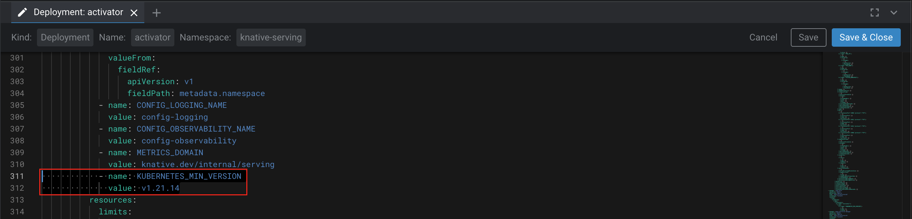

# E2E pipeline using Pachyderm, Determined and Kserve on EKS.

## Prerequisites
* [Determined cluster on EKS](https://docs.determined.ai/latest/cluster-setup-guide/deploy-cluster/sysadmin-deploy-on-k8s/setup-eks-cluster.html) for training jobs
* [Pachyderm](https://docs.pachyderm.com/2.4.x/getting-started/cloud-deploy/aws/) for running pipelines on data management, model training and deploying models for inference.
* [KServe](https://kserve.github.io/website/0.9/) for hosting models for inference


## Installation

### Determined
Install using [helm](https://docs.determined.ai/latest/cluster-setup-guide/deploy-cluster/sysadmin-deploy-on-k8s/install-on-kubernetes.html#install-on-kubernetes). 

Please make sure you attachPolicy for S3 to the unmanaged nodegroup. Example below

```
nodeGroups:
  - name: g4dn-xlarge-us-east-1b
    instanceType: g4dn.xlarge # 8 GPUs per machine
    # Restrict to a single AZ to optimize data transfer between instances
    availabilityZones:
      - us-east-1b
    minSize: 1
    maxSize: 3
    volumeSize: 200
    volumeType: gp2
    iam:
      attachPolicy:
        Version: "2012-10-17"
        Statement:
        - Effect: Allow
          Action:
          - "s3:ListBucket"
          Resource: 'arn:aws:s3:::eks-pdk-demo'
        - Effect: Allow
          Action:
          - "s3:GetObject"
          - "s3:PutObject"
          - "s3:DeleteObject"
          Resource: 'arn:aws:s3:::eks-pdk-demo/*'
```
Create determined namespace and verify Determined UI is accessible
```sh
kubectl create ns determined 
helm install determined <determined-helm-folder> -n determined
kubectl get service determined-master-service-determined -n determined
```
For example - you can access Determined Portal at http://a2aa85f2cdf2d49bd98b32dc1b3ac8b8-xxxxx.us-east-1.elb.amazonaws.com:8080/det/login

### Pachyderm
Follow the instructions [here](https://docs.pachyderm.com/2.4.x/getting-started/cloud-deploy/aws/)

### KServe
For more information on KServe, please visit <a href="https://kserve.github.io/website/0.9/">the official KServe documentation</a>.

The Quickstart environment can be installed with a single command. Make sure that your user has access to the K8s cluster and execute the following command:

```bash
curl -s "https://raw.githubusercontent.com/kserve/kserve/release-0.9/hack/quick_install.sh" | bash
```

The script will install everything you need for KServe, including Knative and Istio, and should take aproximately 5-10 minutes to complete and should create the following new Namespaces:
- cert-manager
- istio-system
- knative-serving
- kserve

In those namespaces you will find various new Pods and Services. All of them should be in the "Running" state.
To check that, use the below set of kubectl commands:

```bash
kubectl get pods -n kserve
kubectl get services -n kserve
kubectl get pods -n istio-system
kubectl get pods -n knative-serving
kubectl get pods -n cert-manager
```

<b>NOTE:</b> If you are running K8s v. 1.21.xx and your cert-manager, istio-system, knative-serving Pods are `Pending`, do the below.

#### Getting KServe to work on K8s 1.21.xx
><b>IMPORTANT:</b> Only complete this step if you are running K8s v. 1.21.xx and your Pods are `Pending`. Otherwise ignore the below.

KServe officially requires K8s v. 1.22.xx for the Quickstart environment. Version 1.21.xx works fine but the Pods in the Namespaces cert-manager, istio-system, knative-serving will hang in the `Pending` state as they expect K8s 1.22.xx or higher.
To remedy that situation, you have to set the environment variable `KUBERNETES_MIN_VERSION` to `v1.21.14` for all the deployments of these Pods.

You can try OpenLens available <a href="https://github.com/MuhammedKalkan/OpenLens">here</a> to interact with K8s cluster or update the KServe k8s yaml files
From within OpenLens, you can directly edit the deployments in question. Find a deployment, click the edit (pencil) button on the top right and add the following under <b>spec/template/spec/containers/env</b>

```bash
            - name: KUBERNETES_MIN_VERSION
              value: v1.21.14
```

Here is a screenshot of my edit for the deployment "activator":



Once the update is made, the Pod will be recreated automatically and should eventually show up as `Running`.
Repeat this process for all Pods/Deployments that are in `Pending` state. 

#### Testing KServe
Now that the KServe Pods are up, it is a good time to validate basic functionality of the serving environment.
This part of the documentation is derived from the <a href="https://kserve.github.io/website/0.9/get_started/first_isvc/#run-your-first-inferenceservice">official KServe documentation.</a>

First, create a namespace to use for deploying KServe resources. For this guide, we will use the namespace `models` for deploying all of the InferenceServices.

```bash
kubectl create namespace models
```

To test KServe, we will use a simple sklearn Iris model that has been created by KServe already.
Define a new InferenceService YAML for the Iris model and apply it to the cluster. Note the format of the YAML - it uses a K8s Custom Resource Definition (CRD), which we will also use later on for our pipelines and models.

```bash
kubectl apply -n models -f - <<EOF
apiVersion: "serving.kserve.io/v1beta1"
kind: "InferenceService"
metadata:
  name: "sklearn-iris"
spec:
  predictor:
    sklearn:
      storageUri: "gs://kfserving-examples/models/sklearn/1.0/model"
EOF
```

Once you applied the InferenceService CRD, you can check on the status of the Service by running the command below. 
Give it a few moments for the Service to change from the `Unknown` to `Ready` state. KServe is deploying the required Pods as Deployments in the background. 

```bash
kubectl get inferenceservices sklearn-iris -n models
```

This is what you should see once the InferenceService is `Ready`.

If this all looks good, you can run the three commands below to define the variables needed to curl the InferenceService. Those are; Ingress Host, Ingress Port, Service Hostname.

```bash
export INGRESS_HOST=$(kubectl -n istio-system get service istio-ingressgateway -o jsonpath='{.status.loadBalancer.ingress[0].hostname}')
export INGRESS_PORT=$(kubectl -n istio-system get service istio-ingressgateway -o jsonpath='{.spec.ports[?(@.name=="http2")].port}')
export SERVICE_HOSTNAME=$(kubectl get inferenceservice sklearn-iris -n models -o jsonpath='{.status.url}' | cut -d "/" -f 3)
```

KServe expects data to be submitted in the `JSON` format. The command below creates the `iris-input.json` file in your current working directory and has two instances of flowers with their length and width of the sepals and petals.

```bash
cat <<EOF > "./iris-input.json"
{
  "instances": [
    [6.8,  2.8,  4.8,  1.4],
    [6.0,  3.4,  4.5,  1.6]
  ]
}
EOF
```

Finally, you can curl your InferenceService using your created `iris-input.json` and the variables defined above:

```bash
curl -v -H "Host: ${SERVICE_HOSTNAME}" http://${INGRESS_HOST}:${INGRESS_PORT}/v1/models/sklearn-iris:predict -d @./iris-input.json
```

If all goes well, you should get your prediction returned as shown below with an HTTP status of 200.

`{"predictions": [1, 1]}`


## Running the example

### Step 1: Creating the K8s Pipeline Secrets

With KServe up and running, it is time to prepare the environment for the Pachyderm pipelines.
The pipelines rely on Kubernetes Secrets to get information about the environment. 
The below `pipeline-secret.yaml` template can be used

```bash
apiVersion: v1
kind: Secret
metadata:
  name: pipeline-secret
stringData:
  det_master: determined-master-service-determined.determined:8080
  det_user: admin
  det_password: ""
  pac_token: ""
  kserve_namespace: models
```

You might have to modify a few things before applying it.

- `det_master`: Should point to your Determined master service in the Namespace where you deployed Determined. (If you followed my guide <a href="https://github.hpe.com/cyrill-hug/Documentation_PDS_Local_EDF/blob/main/README.md">here</a>, the Namespace is `determined`)
- `det_user`: Should be the user you want the pipeline to use to create experiments and pull models.
- `det_password`: Should be the password to the user specified above
- `pac_token`: If you use the Enterprise version of Pachyderm, create an authentication token for a user. Otherwise, if you use the community edition, leave it blank.
- `kserve_namespace`: Should be the Namespace you want the pipeline to create the InferenceServices in.

Once you are happy with your `pipeline-secret.yaml`, apply it like this:

```bash
kubectl apply -f pipeline-secret.yaml
```


## Step 2: Creating the training Pipeline
As the first step to creating the training pipeline, Pachyderm needs an input repository where we can upload data that will trigger the pipeline execution.
Create the input repository in Pachyderm by executing:

```bash
pachctl create repo dogs-and-cats
```

You can validate that the repo was created by checking the WebUI or executing this command:

```bash
pachctl list repo
```

Now we can focus on the training pipeline. The training pipeline will execute the following steps:
1. Get's triggered when new data is uploaded to the input repo `dogs-and-cats`.
2. Schedules an experiment in Determined for training on the newly arrived data. If the pipeline is executed for the first time, it will create a brand new experiment. For any consecutive runs, it will fork the previous experiment and re-train the model on the new data.
3. After training completes, the best checkpoint of the experiment will be registered as a new model version in the Determined.AI model registry.
4. The best checkpoint will also be stored in a versioned Pachyderm output repository called `dogs-and-cats-model`.

Below you can find the training pipeline definition.

Apply the `training-pipeline.json` file

```bash
pachctl create pipeline -f training-pipeline.json
```

You can validate the successful creation of the training pipeline through the WebUI or by running:

```bash
pachctl list pipelines
```

If everything went well, the pipeline should be in the state `running` with last job `success`.

## Step 3: Creating the deployment Pipeline
The deployment pipeline is concerned with deploying a trained model for inference. It completes the following steps:

1. Get's triggered when a new checkpoint is stored in the `dogs-and-cats-model` repo.
2. Pulls the checkpoint from Determined and loads the trial/model.
3. Saves the model as a ScriptModule.
4. Creates a `.mar` file from the `ScriptModule` and the custom `TorchServe handler`.
5. Creates the `config.properties` file for the model.
6. Uploads the `.mar` file and the config.properties file to the GCS bucket.
7. Connects to the K8s cluster and creates the InferenceService. If the pipeline runs for the first time, it will create a brand new InferenceService. If an older version of the InferenceService already exists, it will do a rolling update of the InferenceService using the updated model.
8. Waits for the InferenceService to be available and provides the URL.

Apply `deployment-pipeline.json` file.

```bash
pachctl create pipeline -f deployment-pipeline.json
```

You can validate the successful creation of the deployment pipeline through the WebUI or by running:

```bash
pachctl list pipelines
```


## Step 4: Grant access for pachyderm worker to access inference services

```bash
kubectl apply -f pachyderm-kserve-perm.yaml 
```


## Step 5: Running the Pipeline
As mentioned before, the pipelines automatically run if new data is committed to the input repository `dogs-and-cats`.</br>

For convenience, please find some sample images of dogs and cats in sample-data folder. Once unzipped, you will get the `dog-cat` directory used for this test.</br>

With the command below you can commit all images in the `dog-cat` directory of your machine to the folder `data1` in the Pachyderm repository `dogs-and-cats`.
The folder `data1` will be created as part of the commit process and I recommend to increment the number for each consecutive run. </br></br>

><b>IMPORTANT:</b> While you can name the folder `data1` anything you like, do not use the words "dog(s)" or "cat(s)" as it will mess up the labeling of the images in our data pre-processing code.

```bash
pachctl put file dogs-and-cats@master:/data1 -f dog-cat/ -r
```

As soon as you execute the command above, you will see Pachyderm file uploads. Once the uploads are complete, Pachyderm will start the execution of the `dogs-and-cats-model` training pipeline. At this stage, check the Determined.AI WebUI to see the experiment run. Once it completes, also check the Determined.AI Model Registry to see a new model registered. <b>The Model Version name will be equal to the Pachyderm Commit ID.</b></br>

Next, the `dogs-and-cats-deploy` pipeline will be executed. You can look at the logs of the pipeline execution by clicking on `Pipeline`, then select `Jobs`, select the newest job (probably in the state of `Running`), then select the pipeline stage (`dogs-and-cats-deploy`), and then `Read Logs`. Note that the logs page is not automatically refereshed in Pachyderm v. 2.4.2 and lower. Newer versions of Pachyderm will address this issue. </br>


Once the pipeline execution completes, you should have a new InferenceService called `dogcat-deploy` in the Namespace `models`. You can validate that with this command:

```bash
kubectl get inferenceservices -n models
```


## Step 6: Making a Prediction
Finally it is time to make a prediction with our `dogcat-deploy` InferenceService.
To do that, we first have to get our data prepared. KServe expects data to be submitted in the `JSON` format. For this simple test, use the provided cat.json or dog.json in the sample-data

Once you have your `JSON` files ready, find the external IP Address of our `istio-ingressgateway` with the following command:

```bash
export INGRESS_HOST=$(kubectl -n istio-system get service istio-ingressgateway -o jsonpath='{.status.loadBalancer.ingress[0].hostname}')
export INGRESS_PORT=$(kubectl -n istio-system get service istio-ingressgateway -o jsonpath='{.spec.ports[?(@.name=="http2")].port}')
export SERVICE_HOSTNAME=$(kubectl get inferenceservice dogcat-deploy -n models -o jsonpath='{.status.url}' | cut -d "/" -f 3)
```


```bash
curl -v -H "Host: ${SERVICE_HOSTNAME}" http://${INGRESS_HOST}:${INGRESS_PORT}/v1/models/dogs-and-cats:predict -d @./sample-data/cat.json
```


If all goes well, you should get the predictions returned for both the `cat.json` and the `dog.json` examples with the HTTP status 200 (OK).</br></br>
For `cat.json` you should get class `1` predicted and for the `dog.json` you should get class `0` predicted.
