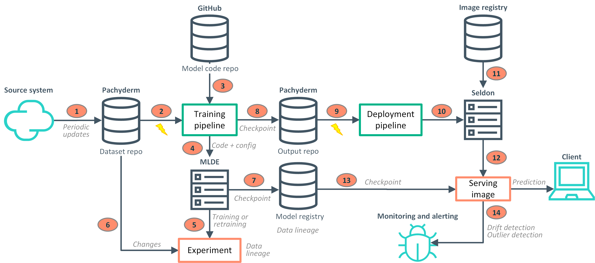

 
# General architecture ####################

Let's consider a use case where training data is produced periodically and contributes to improve an already trained ML/DL model. For example, this could be the case for a clickstream analysis, where user clicks are produced daily or weekly and each time form a new dataset that triggers a retraining.

The architectural diagram for this use case is depicted below:

The process works as follows:
- a generic **source system** generates a new set of datafiles at every interval. These can be images, raw data, tabular data, anything that can be used to feed a ML/DL model. Let's also consider that the amount of new data (i.e. the number of image files) is enough to trigger a retraining of the model

- these datafiles are added to a Pachyderm's **repository** in a single commit (step 1 in the diagram). This is important because every time a commit is issued on the repository, all linked pipelines are triggered and we want a single trigger containing all added files

- after the commit, the **training pipeline** is triggered (step 2). This pipeline will:
  - download the model code from a GitHub's repository (step 3). This is the Determined AI experiment
  - add some information to the model (like Pachyderm's address and token)
  - execute the experiment on Determined AI (step 4). If the model is not yet present into Determined AI's model registry, a standard training will be created otherwise the pipeline will continue the experiment using the latest registered checkpoint on the model. The experiment will be enriched with some tags in order to track its origin
  - wait for the experiment's completion

- the **experiment** is started by Determined AI (step 5)

- when started, the experiment will receive all information about the event, like the name of the Pachyderm's repository, the Pachyderm's job ID which is equal to the commit ID, Pachyderm's location and credentials etc...

- the experiment will then connect to Pachyderm and, using the commit/job ID, will calculate which are the new and updated files (step 6). This list will then be used by the DataLoader to retrieve the specific files from the repository during the training

- when the experiment completes, the training pipeline is resumed. It will:
  - register the best experiment's checkpoint as a new version of the model inside the Determined AI's **model registry** (step 7)
  - download the checkpoint and copy it into the output repository (step 8). This is not strictly necessary but allows future pipelines to build serving containers with the model directly inside them
  - write a special **model-info.yaml** file into the output repository (also step 8) with all model information needed to subsequent steps

- at this point, the training pipeline is ended and we have a new/updated model inside the registry. When this pipeline ends, a commit is done on the output repository and this triggers the execution of a cascading pipeline (step 9), the **deployment pipeline**. 

- this second pipeline will:
  - load the *model-info.yaml* file from its input repository
  - deploy the model on Seldon using the Seldon Deploy SDK (step 10). Any prior deployment with the same name is first deleted
  - when Seldon will receive the deployment request, it will download the **serving image** from the container image registry (step 11) and it will start it providing the mandatory parameters (step 12)
  - when the serving image will start, it will download the model from the registry and use it to serve predictions (step 13)
  - create a **drift detector** and an **outlier detector** (step 14) associated to the deployment (if they are already present, they will be first deleted)
  - wait for the deployment to be ready

---
[Up](../README.md) | [Next](prerequisites.md)