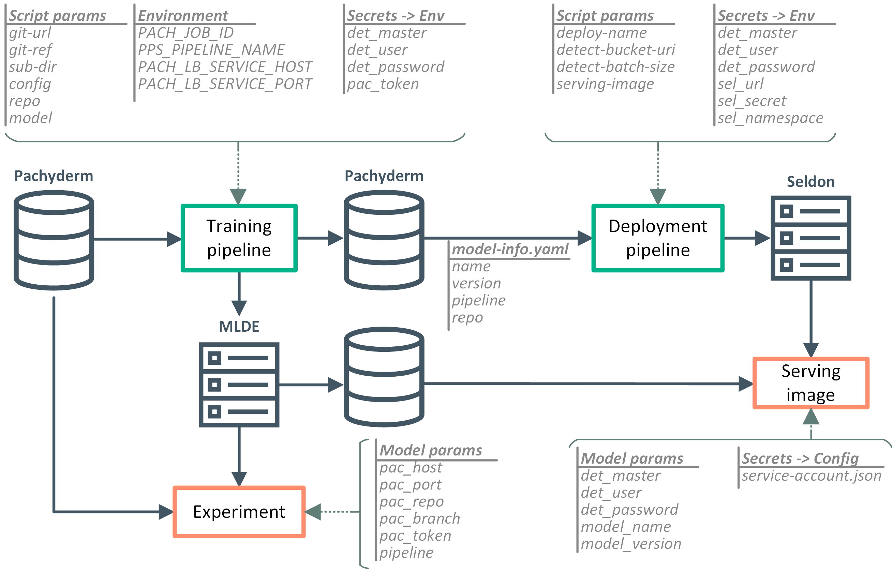

# Building the containers ###################################

We will need 3 containers:
- one to run the training pipeline on Pachyderm
- one to run the deployment pipeline on Pachyderm
- one to serve predictions on Seldon

These containers require several parameters that need to be provided in the form of:
- script parameters (i.e. parameters that will be provided in the Python's command line)
- environment variables
- Kubernetes secrets (like credentials, connection tokens, service account, etc...)

The image below depicts, for each component of the architecture, which parameters it needs and where it expects them:



All files needed to create these containers are located inside the `pachyderm-seldon/container` folder (there is a subfolder for each image). As we are using Google Cloud, we will store our images into the *Google Cloud Registry* (GCR for short).


## The training image

We just need to enter its folder and run a couple of Docker commands: the first one will create the image locally and the second one will push the image to GCR. Here are the commands:

```
cd pachyderm-seldon/container/train
docker build --tag gcr.io/PROJECT/pachyderm-seldon/train:0.0.1 .
docker push gcr.io/PROJECT/pachyderm-seldon/train:0.0.1
```

Of course, you have to replace `PROJECT` with the name of your Google Cloud project.

Pay attention that we are tagging the image with the `0.0.1` version. In the future, if you need to rebuild the image (i.e. you had to change the Python code) you need to use a newer version (like `0.0.2`) and you also have to specify this newer version inside the training pipeline descriptor (which is `training-pipeline.json`).

After this step, you should see the new image in your local repository:

```
$ docker image list
REPOSITORY                                       TAG        IMAGE ID       CREATED         SIZE
gcr.io/determined-ai/pachyderm-seldon/train      0.0.1      72dde3ac3a41   8 days ago      1.31GB
```


## The deployment image

This is created in the same way as the previous one:

```
cd pachyderm-seldon/container/deploy
docker build --tag gcr.io/PROJECT/pachyderm-seldon/deploy:0.0.1 .
docker push gcr.io/PROJECT/pachyderm-seldon/deploy:0.0.1
```

Again, if you need to rebuild the image, remember to update the deployment pipeline descriptor (which is `deployment-pipeline.json`).


## The serving image

This is created in the same way of the previous ones and the same considerations apply:

```
cd pachyderm-seldon/container/serve
docker build --tag gcr.io/PROJECT/pachyderm-seldon/serve:0.0.1 .
docker push gcr.io/PROJECT/pachyderm-seldon/serve:0.0.1
```

In this case, if you need to rebuild the serving image, remember to update the deployment pipeline descriptor with the correct image version (here are two different images: one for the pipeline and another one passed as a parameter to the script).

---
[Up](../README.md) | [Next](pipelines.md)
