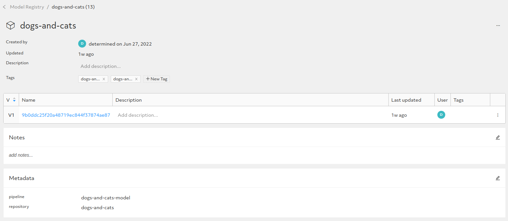
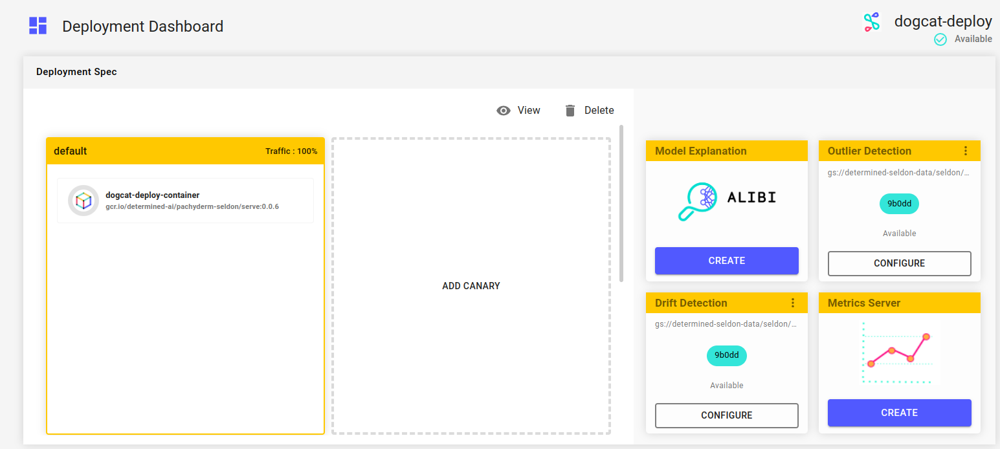
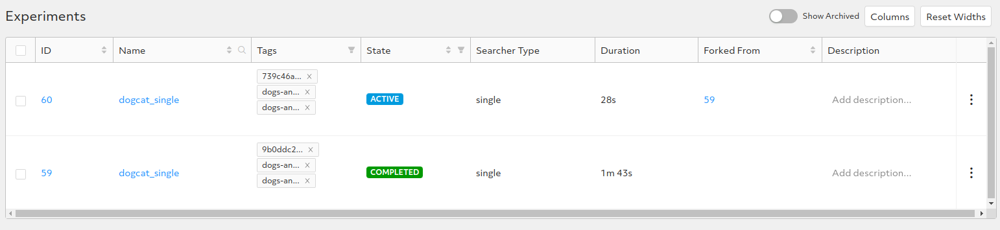

# Running the image classification use case

Now, we are ready to run our first use case, which is located in the `pachyderm-seldon/use-case/image-classification` folder. We will train a model that will try to classify an input image of a dog or a cat. For the next steps, we will start from this folder:

```
cd pachyderm-seldon/use-case/image-classification
```


## Creating the model code ##################

We assume that there is a public GitHub repository somewhere, from which our pipeline can download the model code. For this use case, we have put the model code inside the `experiment` folder as the `https://github.com/determined-ai/works-with-determined` repository is public and we can use it.


## Creating the Pachyderm repository for the dataset #######

For this use case, the ***Dogs vs Cats*** dataset will be considered. It is hosted on Kaggle and it is located at the following address: https://www.kaggle.com/c/dogs-vs-cats/data?select=train.zip . 
This dataset contains 25000 images and here is an example of a dog and a cat present inside that dataset:


To keep things simple, we will consider only a small subset of all files and we will put them into two different folders under the `dataset` one. They are:

 - `data` : this is the initial chunk of files and it will be used to populate the repository the first time. It represents the first arrival of data and it will create the initial model
 - `delta` : this represents the second arrival of data and it will trigger a retraining of the model previously created

To create the Pachyderm's repository, which must be named `dogs-and-cats`, we have to issue just a couple of commands: one to create the repo itself and another one to provide read access to our `seldon` user. Here are the commands:

```
pachctl create repo dogs-and-cats
pachctl auth set repo dogs-and-cats repoReader robot:seldon
```

Now, to verify our new repo, we could issue the following `pachctl list repo` command. We will get an output like this one:

```
NAME             CREATED         SIZE (MASTER) ACCESS LEVEL             
dogs-and-cats    9 seconds ago   ≤ 0B          [clusterAdmin repoOwner]
```

## Creating the pipelines #########

We have two pipelines to create. Of course, they must be created after the repo is created but it is important that the repository is empty when they are created. When we create a pipeline, it will be immediately triggered and if the repo already has some data, it will not be considered as there will be no delta files. To create the pipelines, we just need a couple of commands:

```
pachctl create pipeline -f training-pipeline.json
pachctl create pipeline -f deployment-pipeline.json
```

Then, we will populate it with the images. Here are the commands to do that:

```
pachctl put file dogs-and-cats@master:/data.tar.gz -f data.tar.gz
pachctl list repo
```

## Starting the process ####################

We can now see what happens when data arrives. As we don't have a source system generating periodic data, we have to manually simulate it. We will use the `pachctl` command to simulate the first arrival of data:

```
cd image-classification/dataset
pachctl put file dogs-and-cats@master:/data -f data/ -r
```

The `training pipeline` will be triggered almost immediately and, after a couple of minutes, we should see the experiment on Determined AI' UI, as it is shown below:


Notice that the experiment has some tags that correspond to the source repository, the Pachyderm's job id and the pipeline name that triggered the experiment. When the experiment completes, we can also see the new model present into the model registry and with one version linked to it:



When the first pipeline will end, the `deployment pipeline` will be triggered and after a couple of minutes we should be able to see the deployment on Seldon:



On the top of the image above, we can see the deployment just created, `dogcat-deploy`, on the left the custom container running (our serving image) and on the right the two detectors (drift and outlier).


## Getting predictions #############################

Now that the serving image is running, the next step is to call our deployment to get predictions and we have the `pachyderm/seldon/predict_web.py` code  to do that. We have to pass the Seldon's IP address as a command line parameter and, running the code, you should see a window opening like the following one:


 

## Repeating the process ############################

The final step would be the simulation of the second arrival of data. The files that we are going to use are ready inside the `delta` folder and we can add them as usual:

```
pachctl put file dogs-and-cats@master:/delta -f delta/ -r
```

As usual, the training pipeline will trigger and on the Determined AI's UI we will see the second experiment, which has the `ForkedFrom` column valued, meaning that we are continuing from a previous experiment:



And, on the model registry, we can see the second version of the model being added with the name equal to the second job ID:


---
[Up](../README.md)
