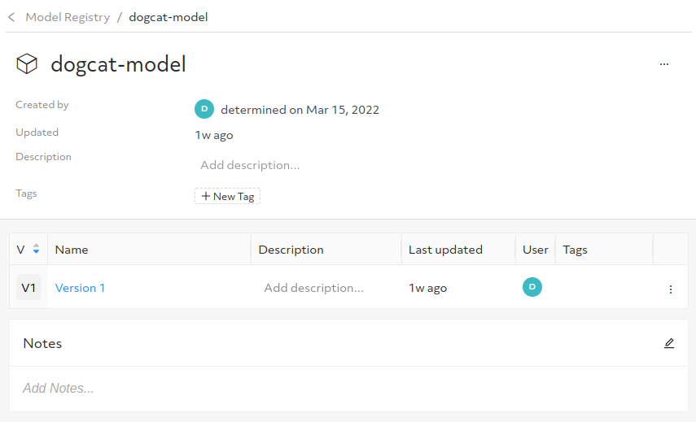

## Creating the Pachyderm repository for the dataset ##############

For this example, the ***Dogs vs Cats*** dataset will be considered. It can be downloaded from Kaggle and it is located at the following address:

https://www.kaggle.com/c/dogs-vs-cats/data?select=train.zip

After you have agreed to the terms & conditions, you can download the train dataset (`train.zip`). This dataset has to be unzipped inside the `pachyderm` folder. You should end up with the following structure:

```
pachyderm
    train
        cat.1.jpg
        dog.1.jpg
        ...
```

This dataset contains 25000 images that will be used for the training. Here is an example of a dog and a cat present inside the dataset:


Now, from within the `pachyderm` folder, we will first create the dataset repository:

```
cd pachyderm
pachctl create repo dogs-and-cats
```

Then, we will populate it with the images. Here are the commands to do that:

```
python3 create-dataset.py
pachctl put file dogs-and-cats@master:/data.tar.gz -f data.tar.gz
pachctl list repo
```

From the `pachctl list repo` command you should see an output like this one:

```
NAME          CREATED     SIZE (MASTER) DESCRIPTION 
dogs-and-cats 2 hours ago ≤ 534.6MiB   
```

The value of the token must be put inside the const.yaml file. Now, we provide read-only access to our token:

```
pachctl auth set repo dogs-and-cats repoReader robot:seldon
```

## Running the experiment

Now, we are almost ready to run our first experiment. We only need to set the Pachyderm's public IP address inside a couple of configuration files. To do that, just enter the `experiment` folder, edit the `const.yaml` file and change the `host` and `token` properties inside the `pachyderm` entry.

We first authenticate to the Determined's cluster (the password is `xxx`, set inside the deployment descriptor) and then issue the command to create the experiment:

```
det user login determined
det experiment create const.yaml .
```

Now, we can navigate the user interface to see our new experiment being trained. You should see something like this:


Once the training is finished, pick up a checkpoint and register it. You have to select "New model" to create a new model. Choose `dogcat-model` as the model name (we will use it later, in the prediction stage). You should have a model in the repository like the one shown below:




## Getting predictions

The last step is to call our deployment to get predictions and we have the `predict_web.py` code  to do that. We have to edit that file to change the DEPLOY_IP with Istio's public IP. Running the code, you should see a window opening like the following one:


 
